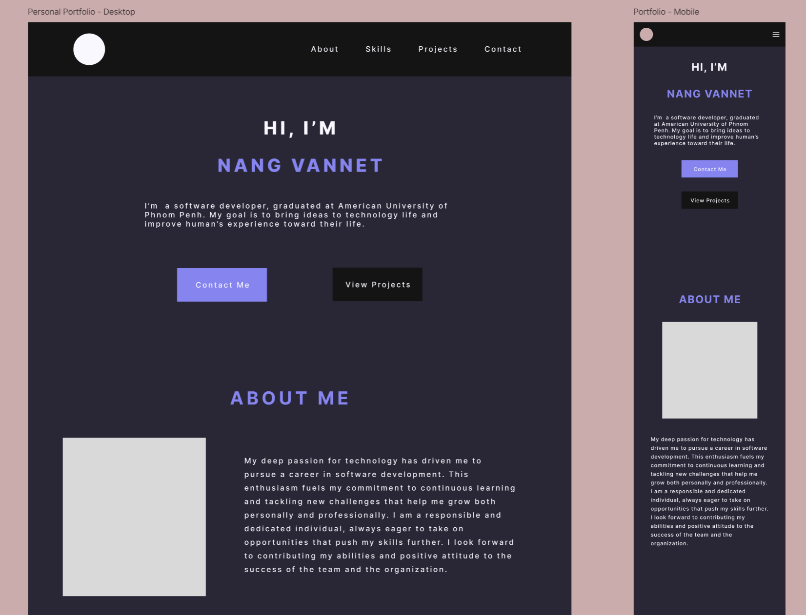

# Personal Portfolio Website

This is my personal portfolio, a modern and responsive website designed to showcase my work. Built with React and Tailwind CSS, it features a clean aesthetic and smooth animations for an engaging user experience.

## 🚀 Features

- 📱 Responsive design that works on all devices
- 🌟 Smooth scroll animations using AOS library
- ✨ Dynamic skills section with hover effects
- 🎨 Interactive project cards
- 📬 Contact form with EmailJS integration
- 🌙 Dark theme with purple accent colors
- ⚡ Smooth navigation with active section highlighting

## 🛠️ Built With

- React
- Tailwind CSS
- EmailJS
- AOS (Animate On Scroll)
- Font Awesome Icons

## 📋 Sections

1. **Hero** - Introduction and call-to-action buttons
2. **About** - Personal introduction and background
3. **Skills** - Technical skills with progress bars
   - Core Languages
   - Front-end Development
   - Back-end Development
   - UX/UI Design
   - Responsive Design
5. **Projects** - Showcase of recent work
   - Gemini Clone
   - Online Shopping System
   - Chat Application
6. **Contact** - Contact form and personal information

## 🚦 Getting Started

1. Clone the repository:

```bash
git clone https://github.com/VannetNang/portfolio-website.git
```

2. Install dependencies:

```bash
cd portfolio-website
npm install
```

3. Create a `.env.local` file and add your EmailJS credentials:

```
VITE_EMAILJS_SERVICE_ID = "your_service_id"
VITE_EMAILJS_TEMPLATE_ID = "your_template_id"
VITE_EMAILJS_API_KEY = "your_api_key"
```

4. Start the development server:

```bash
npm run dev
```

## 🎨 Customization

- Colors and theme can be modified in `index.css`
- Content can be updated in respective component files
- Icons can be changed through Font Awesome classes

## 📞 Contact

Vannet Nang

- Email: VannetNang59@gmail.com
- LinkedIn: [VannetNang](https://www.linkedin.com/in/vannetnang/)
- GitHub: [VannetNang](https://github.com/VannetNang)

## 🙏 Acknowledgments

- Font Awesome for icons
- AOS library for scroll animations
- EmailJS for contact form functionality
